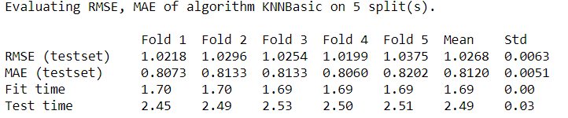
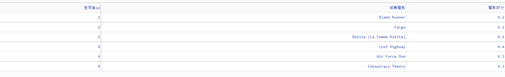
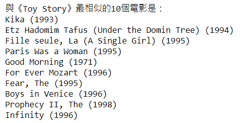

# Recommender_Systems


基於協同過濾(Collaborative Filtering)所實作的推薦系統儀表板，可查詢每位用戶的前三名個人化推薦電影以及每部電影的前十名相似電影。
## Environment
可由下列語法二選一安裝。
```bash
conda install -c conda-forge scikit-surprise 
or
pip install scikit-surprise
```
## Dataset
使用surprise套件中的 [MovieLens dataset](https://grouplens.org/datasets/movielens/)(_MoviesLens 100k_)，由一千多位用戶以及一千七百多部電影共十萬筆電影評價所組成。

## Tain Model
使用KNN(K-Nearest Neighbor)演算法，且參數使用餘弦定理(cosine)訓練。
而交叉驗證結果如下圖


##  Recommender Dashboard
未來可能會再新增項目，而目前規劃目標如下:
- [x] 用戶前三名個人化推薦電影(圖一)
- [x] 每部電影的前十名相似電影(圖二)
- [ ] 標籤篩選電影類型表
- [ ] 每部電影的評分長條圖

##### 圖一 用戶前三名個人化推薦電影


##### 圖二 每部電影的前十名相似電影


## Reference Source
[Python Surprise Official website](http://surpriselib.com/)

## License
BSD 3-Clause license

    @article{Hug2020,
        doi = {10.21105/joss.02174},
        url = {https://doi.org/10.21105/joss.02174},
        year = {2020},
        publisher = {The Open Journal},
        volume = {5},
        number = {52},
        pages = {2174},
        author = {Nicolas Hug},
        title = {Surprise: A Python library for recommender systems},
        journal = {Journal of Open Source Software}
    }